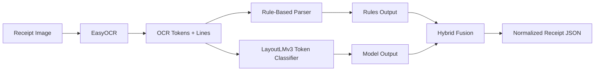

# Hybrid Receipt Extraction System (OCR + LayoutLMv3)

Production-style receipt extraction system that combines OCR, rule-based parsing, and document AI into a single experiment-driven pipeline.

## Overview

Receipt extraction looks simple until it meets real data:

- OCR is noisy on crumpled, low-contrast, skewed, or low-resolution receipts.
- Merchant layouts are inconsistent.
- Pure rules are transparent but brittle.
- Pure models are flexible but depend heavily on label quality and checkpoint quality.

This project solves that by combining:

- `EasyOCR` for text extraction
- a normalized `rule-based parser` for deterministic field recovery
- `LayoutLMv3` for token-level semantic extraction
- `hybrid fusion` to decide when model output should override or complement rules
- an `experiment-driven workflow` for training, comparison, diagnosis, ablation, and checkpoint promotion

What makes this system different is that it is not just an OCR demo or a model notebook. It is a full receipt extraction stack with:

- multiple runtime modes
- reproducible training/evaluation workflows
- weak-label filtering and confidence-aware supervision
- structured experiment reports
- policy selection and checkpoint-promotion support
- both CLI and Streamlit interfaces

## Key Features

- EasyOCR-based receipt text extraction with geometric token/line structure
- Rule-based parsing for vendor, invoice metadata, totals, payment, and line items
- LayoutLMv3 token classification for semantic field extraction
- Hybrid rules + model fusion with configurable thresholds and fallback behavior
- Weak-label training pipeline with filtering, confidence-aware weighting, and critical-field boosting
- End-to-end experiment cycle:
  - train
  - evaluate
  - compare modes
  - run ablations
  - diagnose failures
  - recommend fixes
  - support checkpoint promotion decisions
- Standardized JSON output schema
- Streamlit UI for demo and inspection
- CLI entrypoint for single-image and folder inference

## System Architecture

The runtime pipeline is:

`Image -> OCR -> (Rules + Model) -> Hybrid Fusion -> JSON`



### Runtime components

- `src/receipt_ai/ocr/easyocr_engine.py`
  - OCR extraction and token/line grouping
- `src/receipt_ai/parsing/rules_parser.py`
  - rules-based receipt parsing and normalization
- `src/receipt_ai/model/inference.py`
  - LayoutLMv3 checkpoint inference and decoded field extraction
- `src/receipt_ai/pipelines/entrypoints.py`
  - unified runtime entrypoints for all extraction modes
- `src/receipt_ai/runtime/`
  - default config, output formatting, runtime mode resolution

## Modes Explained

### `easyocr_rules`

OCR + parser only.

Use this when:

- no valid checkpoint is available
- you want the most transparent baseline
- you want deterministic, rule-first extraction

Strengths:

- stable fallback
- explainable behavior
- no model dependency

Weaknesses:

- brittle on unusual layouts
- semantic fields can be missed or mislabeled

### `layoutlm_only`

OCR + LayoutLMv3 only.

Use this when:

- evaluating checkpoint quality directly
- testing model contribution without rules
- benchmarking semantic extraction improvements

Strengths:

- layout-aware semantic extraction
- better potential generalization than rules alone

Weaknesses:

- highly dependent on training quality
- weak checkpoints often underperform rules

### `hybrid`

Runs both paths and fuses them using confidence and field-aware thresholds.

Use this when:

- the checkpoint is strong enough to contribute useful semantic corrections
- you want the best production-oriented output

Strengths:

- preserves rule stability
- uses the model when model evidence is strong
- exposes per-field provenance and confidence in full output mode

Weaknesses:

- depends on checkpoint quality and threshold tuning
- can still fall back to rules heavily if model predictions are weak

## Project Structure

```text
.
├── app.py
├── run_receipt_ai.py
├── default_config.json
├── scripts/
├── outputs/
└── src/
    └── receipt_ai/
        ├── config.py
        ├── schemas.py
        ├── dataset_loader.py
        ├── ocr/
        ├── parsing/
        ├── model/
        ├── pipelines/
        ├── runtime/
        └── evaluation/
```

### Key directories

- `src/receipt_ai/`
  - main package for extraction, training, runtime config, and evaluation
- `src/receipt_ai/ocr/`
  - OCR engine and token/line extraction
- `src/receipt_ai/parsing/`
  - rules parser and normalization
- `src/receipt_ai/model/`
  - training, weak-label alignment, inference, decoding, metrics, checkpoint utilities
- `src/receipt_ai/pipelines/`
  - unified extraction entrypoints and batch runner
- `src/receipt_ai/runtime/`
  - active default config loading, deterministic runtime setup, output formatting
- `src/receipt_ai/evaluation/`
  - field comparison, disagreement analysis, error bucketing, improvement reporting
- `scripts/`
  - training, evaluation, comparison, ablation, diagnosis, checkpoint promotion, reporting
- `outputs/`
  - checkpoints, reports, comparisons, runtime policies, experiment artifacts

## Quickstart

### 1. Create environment

This repo requires Python `3.10+`.

```bash
python3.11 -m venv .venv
source .venv/bin/activate
pip install -r requirements.txt
```

### 2. Finalize the active default config

This reads runtime artifacts and writes `default_config.json`.

```bash
python3.11 scripts/finalize_default_config_receipt_ai.py
```

### 3. Run extraction on one image

```bash
python3.11 run_receipt_ai.py path/to/receipt.jpg
```

Save the result:

```bash
python3.11 run_receipt_ai.py path/to/receipt.jpg --output outputs/demo_receipt.json
```

Run on a folder:

```bash
python3.11 run_receipt_ai.py path/to/receipts --output outputs/demo_batch
```

### 4. Launch the Streamlit demo

```bash
streamlit run app.py
```

## Usage Examples

### CLI example

```bash
python3.11 run_receipt_ai.py data/sample_receipts/receipt_01.jpg --output-mode full
```

### Override mode or checkpoint

```bash
python3.11 run_receipt_ai.py data/sample_receipts/receipt_01.jpg \
  --mode hybrid \
  --checkpoint outputs/layoutlmv3_receipt_ai/smoke_richer_run
```

### Minimal output example

```json
{
  "vendor": {
    "name": "ABC STORE SDN BHD",
    "registration_number": "",
    "address": "NO 12 JALAN MAJU"
  },
  "invoice": {
    "invoice_type": "",
    "bill_number": "B12345",
    "order_number": "",
    "table_number": "",
    "date": "2018-03-14",
    "time": "13:42",
    "cashier": ""
  },
  "items": [
    {
      "name": "MINERAL WATER",
      "quantity": 2.0,
      "unit_price": 1.50,
      "line_total": 3.00
    }
  ],
  "totals": {
    "subtotal": 10.50,
    "service_charge": 0.0,
    "tax": 0.60,
    "rounding": 0.0,
    "total": 11.10,
    "currency": ""
  },
  "payment": {
    "method": "CASH",
    "amount_paid": 20.0
  },
  "metadata": {
    "mode": "hybrid",
    "source_image": "receipt_01.jpg",
    "warnings": []
  }
}
```

## Training Pipeline

The model training stack is designed for weak supervision, not just clean fully labeled data.

### Training flow

1. Load receipt samples and OCR structure
2. Generate pseudo-labels from parser-aligned fields
3. Filter noisy spans and contradictory BIO labels
4. Weight labels by pseudo-label confidence
5. Upweight critical fields such as:
   - vendor
   - date
   - total
6. Train LayoutLMv3 token classifier
7. Save diagnostics and checkpoint artifacts

### Weak-label strategy

Implemented improvements include:

- noisy pseudo-label filtering
- contradictory BIO cleanup
- hard-negative reduction
- confidence-aware supervision
- critical label boosting
- item-label stabilization
- diagnostics for label distribution and sample filtering

### Example training command

```bash
python3.11 scripts/train_receipt_ai_layoutlmv3.py \
  --dataset-root data/SROIE2019 \
  --model-name microsoft/layoutlmv3-base \
  --output-dir outputs/layoutlmv3_receipt_ai \
  --experiment-name smoke_richer_run \
  --loss-type focal \
  --focal-gamma 2.0 \
  --use-class-weights \
  --oversample-non-o \
  --drop-noisy-samples \
  --critical-label-boost 1.75 \
  --weak-label-floor 0.40
```

### Important training flags

- `--loss-type focal`
  - improves learning under class imbalance
- `--use-class-weights`
  - upweights rare labels
- `--oversample-non-o`
  - improves signal from non-background tokens
- `--drop-noisy-samples`
  - removes weak-label outliers
- `--critical-label-boost`
  - prioritizes key semantic fields
- `--weak-label-floor`
  - prevents very low-confidence pseudo-labels from dominating training

## Experiment Workflow

This repo is built around an experiment loop, not ad hoc trial-and-error.

### Workflow

`Train -> Evaluate -> Compare -> Diagnose -> Improve -> Re-evaluate`

### Full experiment cycle

```bash
python3.11 scripts/run_receipt_ai_experiment_cycle.py \
  --baseline-checkpoint outputs/layoutlmv3_sroie \
  --base-model microsoft/layoutlmv3-base \
  --dataset-root data/SROIE2019 \
  --experiment-name improved_vs_baseline_val \
  --output-dir outputs/experiments \
  --split val \
  --seed 42 \
  --max-train-samples 128 \
  --max-eval-samples 64 \
  --epochs 1
```

### Post-experiment diagnosis

```bash
python3.11 scripts/run_experiment_postmortem_receipt_ai.py \
  --experiment-root outputs/experiments/improved_vs_baseline_val
```

### Generated artifacts

Examples of produced outputs:

- `training/checkpoints/...`
- `training/weak_label_analysis/...`
- `baseline/eval/metrics.json`
- `improved/eval/metrics.json`
- `baseline/comparison/comparison_<split>.json`
- `improved/comparison/comparison_<split>.json`
- `ablation/policy_ablation_report.json`
- `report/experiment_summary.json`
- `report/experiment_summary.md`
- `report/failure_cases.json`
- `diagnosis/diagnosis_report.json`
- `diagnosis/next_step_recommendations.json`
- `diagnosis/checkpoint_promotion_decision.json`

## Results & Insights

This system was designed to answer practical questions, not just optimize one validation metric.

### What the experiments are meant to show

- whether the improved checkpoint actually beats baseline
- whether hybrid is better than rules-only and model-only
- whether model contribution increases for critical fields
- whether regressions are concentrated in specific sample types
- whether the checkpoint is good enough to promote to a runtime default

### Main engineering insights from the project

- Rules are often strong baselines for totals and constrained numeric fields.
- The model helps most when semantic structure matters more than surface text patterns.
- Hybrid extraction is only useful when the model is trusted selectively.
- Weak-label quality is often the main bottleneck, not model architecture.
- Item extraction is consistently harder than vendor/date/total extraction.

## Limitations

- Weak supervision quality depends heavily on parser-generated pseudo-labels.
- SROIE is useful but limited for richer-schema receipt extraction.
- Item extraction remains one of the hardest parts of the task.
- OCR quality directly affects both rules and model performance.
- Hybrid mode can still collapse to rules if the checkpoint is weak or thresholds are conservative.

## Future Improvements

- Improve weak-label precision for vendor/date/total and item spans
- Add stronger or larger receipt-specific checkpoints
- Expand evaluation with more diverse annotated receipt data
- Improve item grouping and quantity/price matching
- Add packaging for API/service deployment
- Add dataset and checkpoint versioning for cleaner reproducibility

## Demo / UI

The project includes a Streamlit interface for interactive demos and manual inspection.

Run:

```bash
streamlit run app.py
```

The UI lets you:

- upload a receipt image
- choose extraction mode
- override checkpoint path manually
- see the effective mode and fallback behavior
- inspect vendor, invoice, totals, payment, items, and metadata
- download the final JSON output

## Contributing

Contributions are welcome if they keep the project focused and practical.

Suggested contribution areas:

- receipt-specific data quality improvements
- model and decoder improvements
- better error analysis tooling
- packaging and deployment support
- stronger test coverage around parser/fusion behavior

## Author / Contact

Built as a production-style document AI / receipt extraction project for demonstrating:

- OCR system design
- hybrid ML + rules engineering
- LayoutLMv3 training and evaluation
- experiment-driven model improvement
- practical ML tooling and developer UX

If you want this README tailored further for:

- GitHub portfolio presentation
- Upwork proposal use
- academic/project showcase
- recruiter-facing summary

you can adapt the top sections and results narrative depending on the audience.
